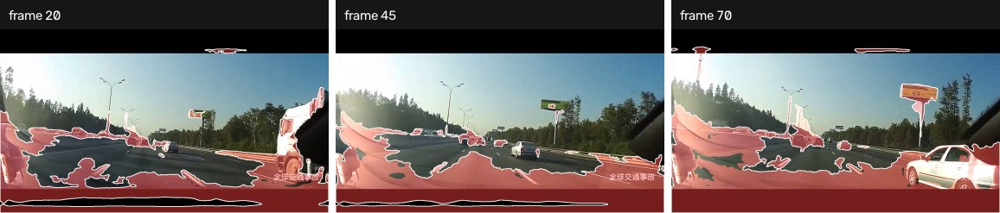

# Configuration

Two kinds, and the split matters: a dataset belongs to everyone, a method
belongs to its branch.

```
configs/
  datasets/   owned by main — every branch sees the same data
  methods/    one file per method, added by that method's branch
```

## Datasets

A `DatasetSpec` says where frames are and how labels are encoded. **Unknown keys
are an error**, not silently ignored — a typo in a label field would otherwise
produce a run that scores against nothing and reports it as a number.

```yaml
name: road_anomaly
root: data/road_anomaly       # relative to the repo, or $VARS, or absolute
images_dir: original
labels_dir: labels            # null for an unlabelled dataset
label_suffix: .png
anomaly_value: 1              # the pixel value that means "anomaly"
void_value: null              # excluded from metrics entirely, never a negative
pattern: ""                   # substring filter on the frame stem
```

`anomaly_value` is explicit because it is the classic silent failure: RoadAnomaly
ships anomalies as 2, SMIYC as 1. Get it wrong and every metric is zero with no
error — so an empty ground truth stops the run instead.

`void_value` matters just as much in the other direction: SMIYC marks ignore
regions as 255, and counting those as negatives quietly inflates every score.

Clip datasets (`tad_*`) set `labels_dir: null`. They carry clip-level labels
only, so those runs produce pictures, not metrics.



*A clip dataset: no green outline anywhere, because there is no per-pixel ground
truth to draw.*

## Methods

One YAML per method, passed to its `build` callable as-is. Values here are the
ones that were actually measured — which is not always the same as the code
defaults they shipped beside, and the comments say when they differ.

Anything unset falls back to `MethodSpec.defaults`. A config can also be handed
in by path:

```bash
open-road run --method raas_distill --config /path/to/experiment.yaml
```
