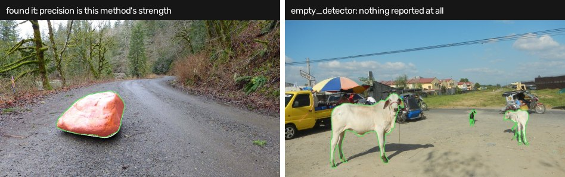
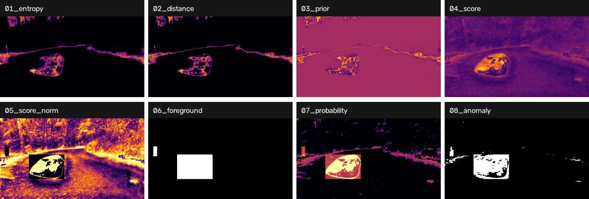

# OoDDINO

Two branches over one frame, fused at the threshold: an open-vocabulary
detector proposes regions, a semantic segmenter's logits are turned into a
per-pixel anomaly score, and the proposals decide *where that score is judged
leniently*.

```
image
  ├─► SegFormer-B2 ──► logits ──┬─► entropy  E ──┐
  │                             ├─► distance D ──┼─► OUAFS prior P
  │                             └─► score    I = energy − median(energy | class)
  │                                                │
  └─► GroundingDINO ──► proposals ─────────────────┘  filtered by mean P in box
                             │
                             ▼
                   foreground = union of surviving boxes
                             │
          I ──► ARNS(I, fg) ──► I_norm ──► dual thresholds T_fg / T_bg
                             │                     │
                             └──► ADT ramp ──► anomaly = P ≥ 0.5
                                          │
                          connected components → suppress nested
                                          │
                                 SAM 2.1 (box prompt) → instances
```



*Both halves of this method in one strip. Left: when the detector fires, precision
is genuinely good — 78.3% pixel precision, above the dense baseline. Right: the
detector returned no boxes at all, so nothing could be reported however anomalous
the pixel branch believed the frame was.*

## The branches are not symmetric

This is the thing to understand before reading any number this method produces.

The **pixel branch does all the arithmetic** and produces every reported pixel.
The **detector branch produces only a binary mask** — the union of surviving
proposal rectangles. It contributes no score, no mask and no label to the
output. Its only jobs are to choose which region gets the lenient threshold and
to gate which blobs may be reported at all.

And the pixel branch feeds the detector branch *first*, through the OUAFS prior
that filters its proposals. So this is a cascade with a loop, not two
independent paths.

The consequence is severe and is the architecture's defining limitation: with
`require_foreground: true`, **a pixel outside every surviving proposal cannot be
reported, however anomalous the pixel branch thinks it is.** A frame where
GroundingDINO fires nothing is an unrecoverable miss. In the prototype that
accounted for 10 of the 19 failing frames on RoadAnomaly — more than half. The
`diagnosis` field in each frame's `intermediate/<stem>/stages.json` names this
when it happens (`empty_detector`).

## This is a reconstruction, not the published method

The [OoDDINO repository](https://github.com/OoDDINO/OoD-DINO) is empty. Neither
the OUAFS module (which fuses uncertainty *inside* GroundingDINO's encoder,
using features this implementation does not have) nor the trained ADT-Net
threshold heads were ever released.

So `maths.py` reconstructs the equations on off-the-shelf checkpoints:

- **OUAFS** keeps the two steps that need no encoder features — gate by a
  sigmoid centred on the image's median entropy, modulate by the orthogonalised
  distance map in place of the cross-attention.
- **ADT-Net's** two learned heads become two quantiles, with the gap between
  them forced open around the ARNS midpoint.

Treat the numbers as a zero-shot reconstruction's, not as the paper's.

## Running it

```bash
pip install -r methods/ooddino/requirements.txt
export HF_HOME=/path/to/an/existing/hf/cache   # optional, saves ~2 GB
open-road run --method ooddino --dataset road_anomaly
```

`transformers>=4.51` is required for SAM 2.1, which is **incompatible with
`methods/raas_distill`** (pinned to 4.44.2). The two methods cannot share an
environment — which is why the skeleton's render, eval and report never import a
method.

## What the dense score means

The skeleton asks for one float per pixel; OoDDINO's output is a set of
instances. `score_source` in `configs/methods/ooddino.yaml` chooses how to
answer, and the choice changes what the metrics measure:

| `score_source` | what it is | what the metrics then mean |
|---|---|---|
| `instances` (default) | the instances rasterised back, each pixel taking its best instance's confidence, background a hard zero | the pipeline's real output, SAM included |
| `probability` | the ADT soft probability, before instance filtering and SAM | an intermediate; better-ranked, but not the answer |
| `residual` | the pixel branch alone, detector/prior/ARNS/SAM bypassed | isolates the half that does not need the detector to fire |

`residual` is the interesting ablation: it is exactly the pixel branch, so
comparing it against `instances` measures what the detector branch and SAM are
contributing — which, on this benchmark, is not obviously positive.

## Knobs worth knowing about

Values in `configs/methods/ooddino.yaml` are the prototype's measured ones, and
they differ substantially from the code defaults that shipped alongside them.

- **`ouafs.prior_threshold: 0.3`** — a sweep in the prototype found this
  saturates: 0.25, 0.2 and 0.1 all produced the same IoU. At the shipped setting
  the filter is close to inert. The reason is in `orthogonalize`: entropy and
  `1 − p_max` are near-monotone functions of each other, so subtracting the
  projection leaves mostly noise, and the resulting prior separates anomaly from
  background *worse than a coin* (AUROC 0.42 measured on RoadAnomaly).
- **`adt.fg_quantile: 0.2` / `bg_quantile: 0.995`** — lenient inside proposals,
  severe outside. Almost everything in a box passes; only the top 0.5% outside
  one does.
- **`adt.alpha: 0.5`** — ARNS output spans `[alpha, alpha+0.5]`, so `[0.5, 1.0]`.
- **`adt.delta: 0.2`** — softens the reported probability only. The binary
  decision `P ≥ 0.5` is exactly `I_norm ≥ T` whatever delta is.
- **`sam.enabled: true`** — measured at **−11.7 F1** in the prototype. It
  sharpens a lone obstacle and destroys a herd: one connected component is one
  box is one prompt, and SAM returns one sheep out of eight. It is left on to
  match the configuration the prototype's numbers came from; turn it off to
  compare.

## Looking at what it did

Every dense intermediate is written per frame, which is the only practical way
to see which stage failed:

```
runs/ooddino/road_anomaly/intermediate/<frame>/
  01_entropy.png     02_distance.png   03_prior.png
  04_score.png       05_score_norm.png 06_foreground.png
  07_probability.png 08_anomaly.png
  stages.json        counts, thresholds, boxes, instances, and `diagnosis`
```

Heatmaps are min-max normalised per image — worth looking at, worthless for
measuring. `stages.json` is where the answer to "why did this frame produce
nothing" lives.



*Every dense intermediate for one frame. Reading left to right and top to bottom
is reading the cascade: the two uncertainty maps, the prior they fuse into, the
class-conditional score, its per-region normalisation, the detector's gate, the
soft probability and the binary decision. `06_foreground` is the one to check
first — if it is empty, nothing downstream can report anything.*

## Where it stands

The prototype's own notes are blunt about this architecture: measured on
RoadAnomaly it did not beat a plain dense model, and it was superseded by RbA.
It is carried here because it is a genuinely different shape — a detector and a
dense branch fused — and because the ablation between its `residual` and
`instances` sources is informative about *why* the fusion did not pay.
