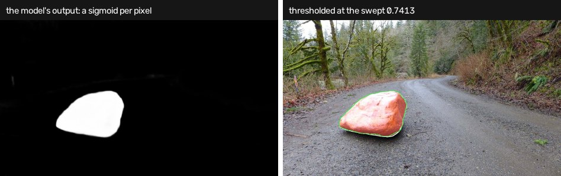
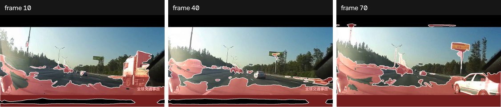
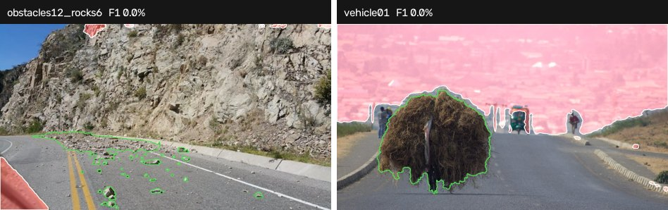

# RAAS-Distill

A real-time student distilled from **RAAS** (Mask2Former Swin-L + CLIP) for road
anomaly segmentation.

The teacher runs at **0.2–0.4 FPS**. The student is **3.72M parameters, 14 MB**,
and matches or beats it on both SMIYC tracks.



*Left is what the network actually returns: one sigmoid per pixel, 988 distinct
values on this frame. Right is that map thresholded at the swept operating point.
Only the left image is the method's output — the right one is the shared render
stage.*

| model | Anomaly AUPR / FPR@95 | Obstacle AUPR / FPR@95 | size |
|---|---|---|---|
| teacher `maskomaly` | 94.09 / 3.40 | 88.62 / 2.81 | ~215M params |
| teacher `maskomaly_id` (distilled from) | 93.18 / 3.42 | 91.21 / 0.42 | ~215M params |
| **student, 1024px** | 94.02 / 7.14 | **97.52 / 0.07** | **3.72M params** |
| **student, 544px** | **95.83 / 4.76** | 92.05 / 0.79 | **3.72M params** |

The student beats its own teacher on ObstacleTrack by 6.3 AUPR. This is not
unusual for distillation: the teacher's decision is assembled from hard-coded
thresholds over Mask2Former queries, while the student learns a dense map over
572 frames and smooths away the individual failures of those rules — most
visibly on the small obstacles the teacher handled worst.

> **On comparability.** These numbers were measured with the project's own
> pooled pixel metrics, not the official SMIYC evaluator, which treats void
> pixels differently and also reports component metrics. Treat the table as
> internally consistent, not as a benchmark submission.

## Running it

```bash
pip install -r methods/raas_distill/requirements.txt
open-road run --method raas_distill --dataset road_anomaly
```

Settings live in `configs/methods/raas_distill.yaml`; `--short-side` is the one
that matters and has its own section below.

As a library, without the CLI:

```python
import cv2
from methods.raas_distill.method import AnomalySegmenter

segmenter = AnomalySegmenter({"short_side": 736})
score = segmenter.score(cv2.imread("frame.jpg"))   # float32 [H, W] in [0, 1]
```

The output is a per-pixel anomaly probability at the resolution of the frame you
passed in. **It is a ranking, not a calibrated probability**: AUPR and FPR@95
depend only on the ordering of pixels, and nothing in training pushed the values
towards being read literally. Choose a threshold on your own validation data,
and drop connected components below a minimum area — on this benchmark that
single post-processing choice moves component F1 by tens of points.

**`transformers==4.44.2` is a hard pin.** SegFormer's internal module names
changed in 5.x (`encoder.block` → `stages.blocks`), and the released weights
will not load on the newer layout.

**No network needed.** The architecture is built from a vendored config
(`student/segformer_b0_cityscapes.json`), so nothing is downloaded at run time —
the pretrained backbone would only be fetched to be overwritten by the
checkpoint. Verified with `HF_HUB_OFFLINE=1` against an empty cache.

## Choosing the short side

Resolution is the one knob that matters, and the two SMIYC tracks pull in
opposite directions. Anomalies on AnomalyTrack are large, so downscaling removes
noise and *helps*. Obstacles are tens of pixels across, so downscaling destroys
them.

| short side | Anomaly AUPR | Obstacle AUPR | A100 fp16, full pipeline |
|---|---|---|---|
| 1024 | 94.02 | **97.52** | 19.4 FPS |
| 736 | 95.18 | 95.67 | **36.6 FPS** (p99 32.6) |
| 544 | **95.83** | 92.05 | 54.3 FPS |
| 384 | 95.02 | 83.56 | — |

Pick 1024 if small obstacles matter, 736 for real time, and do not go below 544.

## Latency

Measured end to end — resize, normalise, host→device, forward, upsample,
device→host — not forward alone. On an A100-SXM4-80GB the forward pass at 1080p
fp16 takes 20.7 ms but the surrounding work takes **36.8 ms more**, so the honest
figure is 17.4 FPS rather than the 48 FPS a forward-only benchmark reports.

```bash
python -m methods.raas_distill.profile \
    --checkpoint methods/raas_distill/weights/student_final.pt --per-module
```

The profiler reports p50/p90/p99 rather than the mean, because a real-time
consumer drops frames on the tail; it synchronises the device around every step,
without which the timer measures how fast Python enqueues work rather than how
fast anything computes.

Most of the overhead is `cv2.resize` and the numpy normalise on the CPU, which
fp16 does nothing for. Moving both onto the device is the obvious next win and
would put 1080p comfortably past 30 FPS.

Raw measurements: `results/profile_a100.json`, `results/profile_m5.json`.



*At 0.36 s/frame on a laptop this is the only method here fast enough to put
through video. All 41 TAD clips ran; the mp4s sit beside the frames.*

## Architecture

`student/model.py` — SegFormer-B0 with the classifier widened from 19 to 20
channels. Channels 0–18 keep their pretrained Cityscapes weights; channel 19 is
the anomaly logit, initialised with bias −4.0 so the model starts by predicting
"not anomalous" everywhere. Anomalous pixels are well under 1% of the corpus and
a zero-init head wastes its early capacity unlearning a 50/50 prior.

Nothing else is bolted on: the anomaly score the teacher produces is a function
of the same semantics the first 19 channels predict, so the encoder is shared.

`student/losses.py` — soft BCE against the teacher's map plus Dice (mandatory at
this class imbalance), and KL on the 19 semantic channels as a regulariser.

`student/preprocess.py` — resize and normalise, in one place. It was duplicated
across four files in this method's original form.

## Training

See [`train/README.md`](train/README.md). It needs the RAAS monorepo, which is
not vendored here; inference does not.

## What is measured, and what is not

* Metrics: 40 held-out SMIYC validation frames (10 Anomaly, 30 Obstacle). Small,
  so treat differences under a point as noise.
* Latency: measured on A100-SXM4-80GB and Apple M5. **Not** measured on
  automotive hardware; an Orin figure would need an Orin.
* The corpus is 572 frames.



*Where it breaks, at the same threshold. Left: a scatter of rockfall, none of it
found. Right: nothing reported at all. Both score 0.0% per-frame F1, and both are
in `road_anomaly_sample`, which deliberately holds the best and worst frame of
every category.*

## Licence and credit

The student weights and this method's code are MIT (`LICENSE`).

The pipeline stands on work that carries its own terms, and reproducing the
teacher means accepting them:

* [Maskomaly](https://github.com/jan-ackermann/Maskomaly) — the anomaly method the teacher implements
* [Mask2Former](https://github.com/facebookresearch/Mask2Former) — teacher backbone, MIT
* [detectron2](https://github.com/facebookresearch/detectron2) — Apache 2.0
* [SegFormer](https://github.com/NVlabs/SegFormer) — student backbone, NVIDIA Source Code Licence; the pretrained Cityscapes weights come via HuggingFace
* [CLIP](https://github.com/openai/CLIP) — used by the teacher's ID/OOD branch
* [SegmentMeIfYouCan](https://github.com/SegmentMeIfYouCan/road-anomaly-benchmark) — benchmark and official evaluator

Cityscapes, from which the student's backbone is pretrained, is free for
academic and non-commercial use only. Check it before any commercial deployment.
