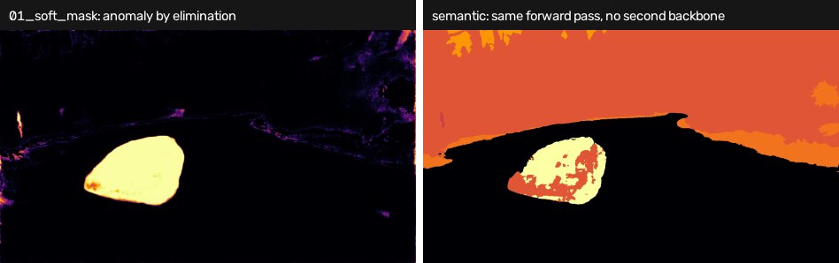

# RAAS + Objectomaly

RAAS produces a map whose **values** are reasonable and whose **boundaries** are
not: Mask2Former query masks are smooth blobs, so an obstacle's score bleeds
across its edge. Objectomaly borrows edges from SAM, which segments objects
without knowing what they are.

```
RAAS ──► coarse map ──┐
                      ├─► OASC ──► MBP ──► refined map
image ──► SAM ──► postprocess ──┘
```

- **OASC** (Object-Aware Score Calibration) rescores each SAM region against its
  own statistics.
- **MBP** (Mask-Boundary Precision) rewrites the residual in a band around each
  boundary.

Neither is implemented here — see [Licensing](#licensing).



*Not this method's output — this method has never been run here. It is its
**input**: the RAAS map that OASC recalibrates and MBP re-edges, produced by the
`raas` branch on the same frame. The blob is exactly the problem the refinement
exists to fix — the score is right, the boundary is a smear.*

## The environment split is not ported

The source branch ran RAAS in python 3.8 / torch 1.9 and SAM in 3.10 / torch 2.1,
passing float32 maps between them through a bespoke `.npy` cache with its own
manifest schema, driven by `conda run -n`.

That cache is gone. Its job was to move one array between two processes, and the
skeleton already does that through `score_raw/*.npy`. The split itself was a
consequence of old pins rather than of the architecture — detectron2 builds
against modern torch — so this ships as one scorer in one process.

If a single environment turns out to be impossible on some machine, the fallback
is to run `raas` alone and feed its `score_raw/` here. That path is deliberately
**not implemented**: writing it before anyone needs it would be guessing at the
shape of a problem that may not exist.

## Weights

Two checkpoints to fetch by hand, plus CLIP's, which fetches itself.

**Mask2Former Swin-L, Cityscapes semantic** — shared by all three RAAS variants;
`_id` and `_ood` have no weights of their own, differing only in CLIP prompts and
post-processing:

```bash
mkdir -p "$RAAS_ROOT/Maskomaly/maskomaly/ckpt"
curl -L https://dl.fbaipublicfiles.com/maskformer/mask2former/cityscapes/semantic/\
maskformer2_swin_large_IN21k_384_bs16_90k/model_final_17c1ee.pkl \
  -o "$RAAS_ROOT/Maskomaly/maskomaly/ckpt/model_final_17c1ee.pkl"
```

**SAM ViT-H** — `-C -` resumes an interrupted download. The digest is verified on
load, because SAM ships several checkpoints with similar names and the wrong one
degrades results silently rather than failing:

```bash
curl -L -C - https://dl.fbaipublicfiles.com/segment_anything/sam_vit_h_4b8939.pth \
  -o checkpoints/sam_vit_h_4b8939.pth
md5sum checkpoints/sam_vit_h_4b8939.pth   # 4b8939a88964f0f4ff5f5b2642c598a6
```

**Objectomaly ships no weights at all** — OASC and MBP are algorithms with no
checkpoints. Only the source is needed, and it must stay unmodified; see
[Licensing](#licensing).

## Running it

```bash
export RAAS_ROOT=/path/to/raas                    # Mask2Former + detectron2 + Maskomaly
export OBJECTOMALY_ROOT=/path/to/Objectomaly      # cloned at 66d2ad2a, unmodified
export SAM_CHECKPOINT=/path/to/sam_vit_h_4b8939.pth
pip install -r methods/raas_objectomaly/requirements.txt
open-road run --method raas_objectomaly --dataset road_anomaly
```

`refine: false` in the config runs RAAS alone. That is the comparison worth
making first — the open question about this method is whether the refinement
pays for itself, and on one of two tracks it does not.

## Reference numbers (SMIYC validation: 10 Anomaly + 30 Obstacle frames)

These are for the *later* `raas-sky-road` configuration, which adds global fusion
on top of what is here; the plain refinement's own numbers were never committed.

| | AnomalyTrack mean F1 | ObstacleTrack mean F1 |
|---|---|---|
| RAAS alone (`maskomaly_id`) | 62.26 | 58.65 |
| + refinement + fusion | 38.36 | **73.00** |

**The result is ambiguous and should be presented as such.** ObstacleTrack gains
14 points of mean F1 and PPV climbs 53.6 → 89.4; AnomalyTrack loses 24 points to
false object components. A method that is a clear win on small road obstacles and
a clear loss on large anomalies is not "better" — it is differently tuned, and the
config was tuned on the same 40 frames it is scored on.

## Cost

**SAM generate + postprocess ≈ 41 s/frame on an A100**, about two thirds of a
58–64 s/frame pipeline. RAAS itself is 4–5% of it. This is not a real-time method
and no amount of tuning makes it one; halving `points_per_side` is the first lever
if you need it merely *less* slow.

The SAM bundle depends only on the image, so `Refiner` caches it: three RAAS
variants over one dataset share a single SAM pass rather than paying 41 s three
times.

## Licensing

**Objectomaly is never vendored, and that is not a packaging preference.** The
pinned commit `66d2ad2a` ships no LICENSE file. The source branch's own
`docs/OBJECTOMALY_LICENSE_STATUS.md` sets out the constraints: keep it an
unmodified external checkout, do not vendor or modify it, do not publish a
combined archive or container, do not describe it as open source, local
evaluation only pending written permission.

`refine.py` therefore owns only the wiring — config, the SAM generator, mask
caching, call order — and imports OASC and MBP from `$OBJECTOMALY_ROOT`.

## What is verified, and what is not

This method cannot be run here: `$RAAS_ROOT`'s Swin-L checkpoint has no published
URL, the SAM ViT-H weights are absent, and Objectomaly is not cloned. So:

- `tests/test_raas_objectomaly_maths.py` pins the RAAS formulas against hand-made
  query tensors, including that the vectorised border rule is bit-identical to the
  original all-pairs loop.
- `tests/test_raas_objectomaly_refine.py` covers everything on this side of the
  Objectomaly boundary: that a missing checkout fails with a usable message, that
  the SAM digest is enforced, that the stage order is SAM → OASC → MBP, that the
  Gaussian kernel is handed over as a tuple, and that one SAM pass is reused.
- **No number in this README was reproduced.** They are quoted from the source
  branch's `metrics/`.

## Looking at what it did

```
runs/raas_objectomaly/<dataset>/intermediate/<frame>/
  01_coarse.png     RAAS, before refinement
  02_road_holes.png candidate geometry            (_id / _ood variants)
  03_refined.png    after OASC + MBP
  04_delta.png      refined − coarse
  stages.json       variant, SAM mask count, per-candidate CLIP verdicts
```

`04_delta` is the one to look at: it shows exactly where the refinement disagreed
with RAAS, which is the whole question about this method.

## Credit

[Objectomaly](https://github.com/hon121215/Objectomaly) for OASC and MBP;
[Segment Anything](https://github.com/facebookresearch/segment-anything) for the
mask generator; the RAAS half is credited in the shared modules and in the `raas`
method's README.
