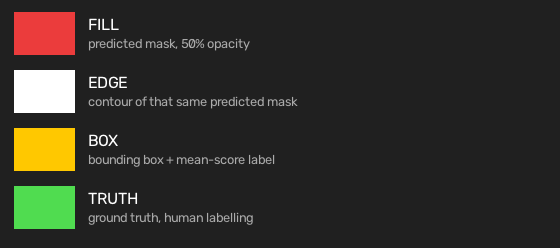
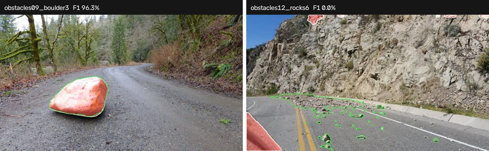

# The stages

Five steps, run in this order by `open-road run`:

```
infer ──► evaluate ──► render ──► video
             │
          report (across runs)
```

`evaluate` runs **before** `render`, which looks backwards until you see why: it
sweeps the threshold and reports the best-F1 operating point, and render then
draws that point. Rendering at the method's fixed default instead would draw one
mask and score a different one — the picture and the number would disagree.

| stage | reads | writes | imports a method? |
|---|---|---|---|
| [`infer.py`](infer.py) | frames | `score_raw/`, `soft_mask/`, `intermediate/` | **yes** |
| [`evaluate.py`](evaluate.py) | `score_raw/`, labels | `metrics.json` | no |
| [`render.py`](render.py) | `score_raw/`, labels | `render/` | no |
| [`video.py`](video.py) | `render/overlay/` | `<dataset>_overlay.mp4` | no |
| [`report.py`](report.py) | several `metrics.json` | `comparison.{md,csv,json}` | no |

Only `infer` loads a model. Everything else works off the stored `.npy`, which
is what allows methods with conflicting dependencies to be scored and compared
by the same code in the same environment.

## infer

Resumable: a frame with an existing map is skipped unless `--overwrite`. The
first frame carries lazy CUDA/MPS initialisation and is excluded from the
per-frame timing.

A scorer may leave a `last_debug` dict on itself; infer writes it under
`intermediate/<stem>/` and dispatches on type — bool arrays become binary masks,
float arrays heatmaps, HxWx3 uint8 images, anything else JSON. The stage never
interprets what it is writing, so a method with nothing to show costs nothing.

## evaluate

Pixel metrics pooled over every valid pixel: AP, AUROC, FPR@95, and
precision/recall/F1 at the sweep's best-F1 point. Component metrics follow
SegmentMeIfYouCan — sIoU over ground-truth components, PPV over predicted ones,
F1\* averaged over eleven thresholds from 0.25 to 0.75.

Void pixels are dropped, not counted as negatives. An empty ground truth stops
the run rather than reporting metrics against nothing — the usual cause is a
label-encoding mismatch, and reporting 0.0 would hide it.

## render

Threshold, drop components below `min_area`, draw. Both knobs are recorded in
`regions.json` so a picture can always be traced back to the numbers.

Colours: red fill for the predicted mask, white for its contour, yellow for each
component's box and mean score, green for ground truth. `--draw` picks `seg`,
`boxes` or `both`.





*Red and white are the model's answer, green is the correct one. Green with no red
inside it is a miss; red outside green is a false alarm.*

## video

A clip is a folder of frames, so it is already a dataset; this only puts the
overlays back together. Frame order comes from `DatasetSpec.frames()`, never
from globbing the overlay directory.

Frames are symlinked into a zero-padded temporary sequence before encoding: a
glob pattern hands ffmpeg the lexicographic order and undoes the sort, and the
concat demuxer drops the last frame's duration unless the final file is
repeated, which then encodes one frame too many. Numbering makes both exact.

libx264 through ffmpeg when it is present, OpenCV's mp4v otherwise.
